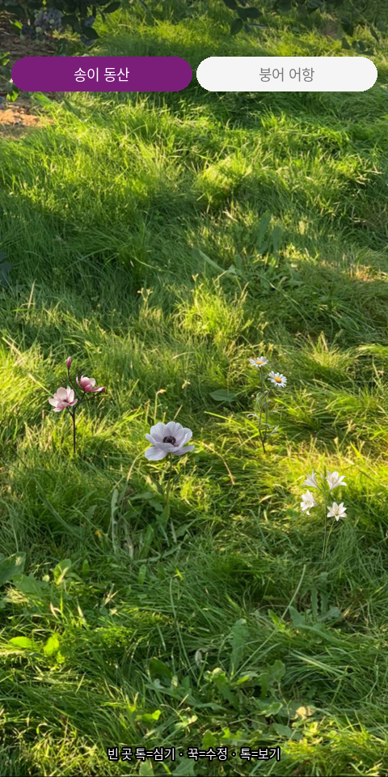
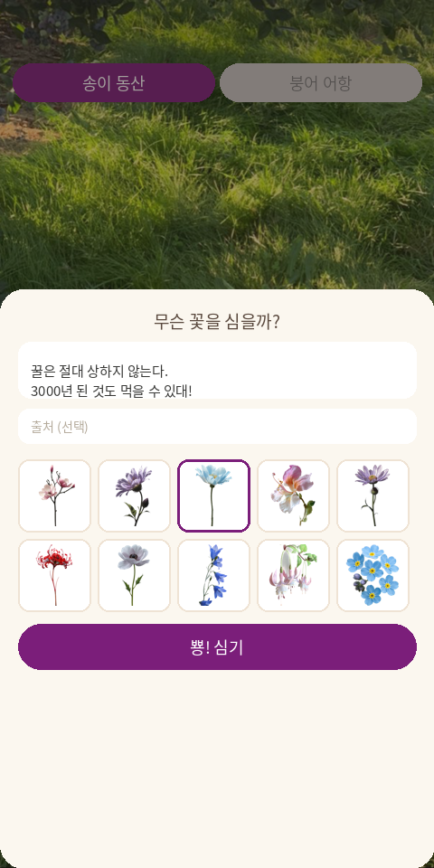
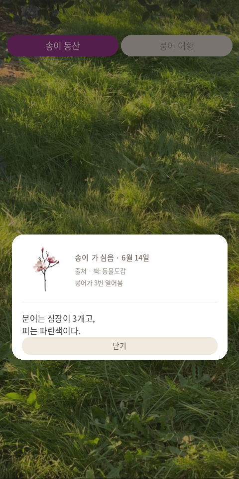

# 🌿 Tidbit

> a little something you didn't know — 둘이 심는 잡지식 정원

책·뉴스·SNS에서 주운 **한 줄짜리 잡지식**을 심으면 꽃과 수초로 피어나는, 단 두 사람(송이 · 붕어)을 위한 작은 정원입니다. 위쪽은 **송이 동산**(꽃), 아래쪽은 **붕어 어항**(수초·조개). 빈 곳을 톡 누르고, 그림을 골라 심으면 끝.

<p>
  
  
</p>

---

## 어떻게 노나요

**심기 — 빈 곳을 톡, 그림을 골라서**
잡지식 한 줄을 적고, 마음에 드는 그림(꽃 30종 / 수초·조개 30종)을 눈으로 보고 고른 뒤 "뿅! 심기". 이름을 입력할 필요는 없습니다. 출처를 적어두면 다음에 자동으로 워터마크로 따라옵니다.

<p></p>

**구경 — 도감처럼 펼쳐보기**
심긴 꽃을 톡 누르면 도감 카드가 열립니다. 누가 · 언제 심었는지, 출처, 그리고 상대가 몇 번 열어봤는지(hit)까지 한눈에.

<p></p>

**반짝임 — 상대가 새로 심은 건 빛나요**
상대가 심었는데 내가 아직 안 본 지식은 금빛으로 반짝이고 `NEW` 배지가 붙습니다. 열어보면 반짝임이 사라집니다.

<p></p>

---

## 주요 기능

- **두 세계** — 송이 동산(꽃) ↔ 붕어 어항(수초·조개), 탭으로 전환
- **자유 배치** — 그리드 없이 원하는 곳에 심고, 꾹 눌러 드래그로 이동, 슬라이더로 크기 조절(최대~1/5)
- **그림으로 선택** — 텍스트 대신 썸네일을 보고 골라 심기
- **출처 워터마크** — 가장 최근 출처가 자동 기본값으로
- **hit 카운트** — 상대가 내 지식을 몇 번 열어봤는지 기록
- **반짝임 알림** — 상대의 미확인 지식은 빛남
- **아카이브** — 뽑은 지식은 사라지지 않고 DB에 보관
- **내 정원만 심기** — 상대 플레이그라운드에서는 구경·읽기만 가능
- **사용자 기억** — 마지막으로 고른 "나(송이/붕어)"를 기억해, 다음에 열면 자기 페이지가 메인으로
- **풀스크린** — 홈 화면에 추가하면 노치까지 꽉 찬 앱처럼 사용

---

## 기술 구성

| 구분 | 사용 |
|------|------|
| 프론트 | 단일 `index.html` (바닐라 JS) |
| 서버 | Node.js + Express |
| DB | SQLite (`better-sqlite3`) — 잡지식·위치·hit·아카이브 저장 |
| 전송 | JSON REST API |
| 배포 | Docker (라즈베리파이 + DDNS) |

데이터가 사는 곳은 두 군데입니다. **잡지식 등 공유 데이터는 라즈베리파이의 `data/tidbit.db`(SQLite)**, **"나는 송이/붕어"라는 기기별 설정만 각 폰 브라우저(localStorage)**에 저장됩니다.

---

## 실행 방법 (라즈베리파이)

```bash
# Docker로 백그라운드 실행 (권장)
docker compose up -d --build

# 상태 / 로그 / 중지
docker compose ps
docker compose logs -f
docker compose down
```

외부 포트는 `2229`로 설정되어 있습니다 (`docker-compose.yml`에서 변경 가능). 공유기 포트포워딩 후 모바일에서 `http://<DDNS주소>:2229` 접속 → **공유 → 홈 화면에 추가**로 앱처럼 사용하세요.

Docker 없이 직접 실행하려면:

```bash
npm install
PORT=2229 node server.js
```

---

## API 요약

| 메서드 | 경로 | 설명 |
|--------|------|------|
| GET | `/api/items?page=garden\|tank` | 활성 지식 목록 |
| POST | `/api/items` | 심기 |
| PATCH | `/api/items/:id` | 위치·크기 변경 |
| POST | `/api/items/:id/view` | 조회 기록 (hit +1, seen) |
| DELETE | `/api/items/:id` | 뽑기(아카이브 보관) |
| GET | `/api/lastsource` | 최근 출처 |
| GET | `/api/archive?page=` | 아카이브 목록 |

---

## 폴더 구조

```
Tidbit/
├─ index.html            # 앱(프론트)
├─ server.js             # Express + SQLite 서버
├─ package.json
├─ Dockerfile
├─ docker-compose.yml
├─ public/
│  ├─ flowers/           # 배경 + 꽃 1~30.png (512×512)
│  └─ waterweeds/        # 배경 + 수초·조개 1~30.png
├─ data/                 # tidbit.db (자동 생성, 영구 보관)
└─ docs/                 # README용 이미지
```
